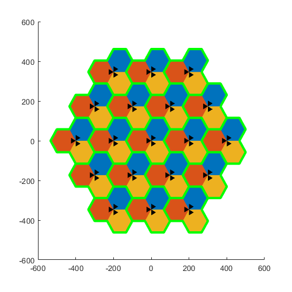
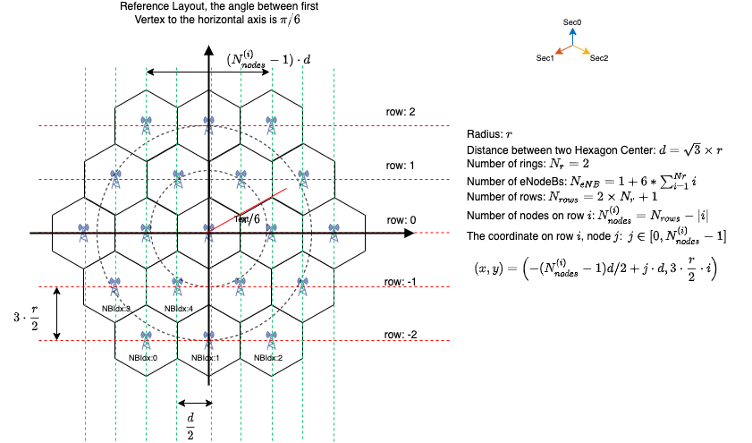

# Tri-Sector-Network-Geometry
Draw Celluar Layout for tri-sector nodeBs in a hexgonal grid

A hexagon is a tessellating cell shape in that cells can be laid next to each other with no overlap;
therefore, they can cover the entire geographical region without any gaps. This approximation is frequently employed in planning and analysis of cellular networks.

Each site has three sectors(A.K.A. base stations). The number of sites is decided by the number of rings. If the number of rings is 0, then there is only one site in the network.
The first ring around the center site has 6 sites. The second ring has 12 sites, etc... 
 

### How to caculate site postions

